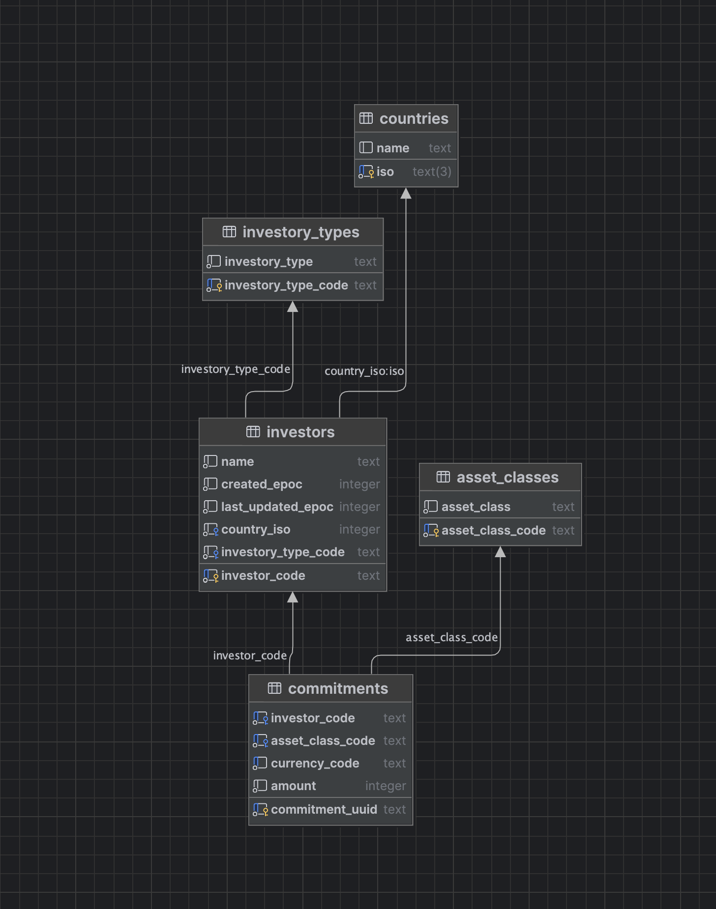

# Assets Under Management Database Creation

This project includes a Python script that creates a SQLite database based on an SQL file containing the necessary schema and data. The script will recreate the database if it already exists.



## Files

- `create_assets_under_management_db.py`: The Python script that creates the SQLite database.
- `assets_under_management.sql`: The SQL file that contains the schema and data to populate the database.

## Prerequisites

- Python 3.12 or later (SQLite is included in Python's standard library, so no additional packages are required).

## How to Create the Database

1. **Place the SQL File**:
   Ensure that the `assets_under_management.sql` file is in the same directory as the `create_assets_under_management_db.py` script.

2. **Run the Script**:
   Execute the following command in your terminal or command prompt to create the database:

   ```bash
   python create_assets_under_management_db.py