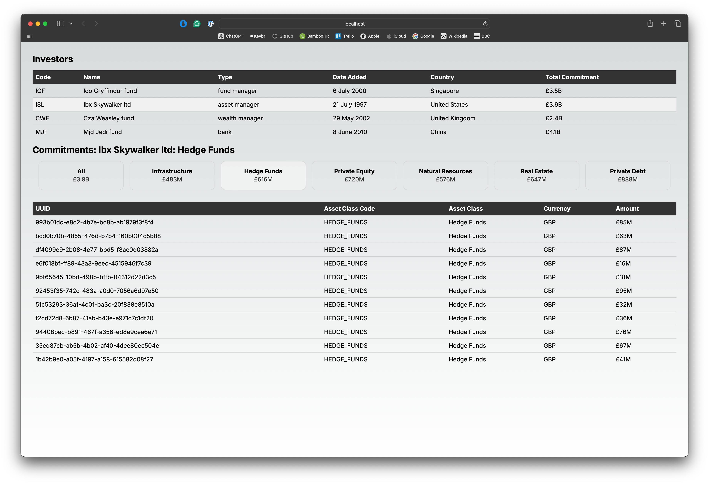

# Alternative Assets Frontend

This is the frontend for the Alternative Assets project, built with Next.js and TypeScript. The project relies on a backend API, which should be configured and running locally. You can find the backend repository [here](https://github.com/mbarclay/alternative-assets-fullstack/tree/main/alternative-assets-backend).



## Prerequisites

Before you begin, ensure you have the following installed:

- [Node.js](https://nodejs.org/) (v16.x or later recommended)
- [npm](https://www.npmjs.com/) (v8.x or later recommended)
- The Python FastAPI [backend](https://github.com/mbarclay/alternative-assets-fullstack/tree/main/alternative-assets-backend), is available, configured and running locally.

## Getting Started

### Clone the repository:

```bash
git clone git@github.com:mbarclay/alternative-assets-fullstack.git
cd alternative-assets-fullstack/alternative-assets-frontend
```

### Install dependencies:

```bash
npm install
```

### Environment variables:

A default local environment variables `.env` configuration has been supplied with the project and (although non-standard) deliberately commited to the project.

### Run the development server

```bash
npm run dev
```

The application should now be running at http://localhost:3000.

## Available scripts

- `npm run dev`: Starts the Next.js development server at http://localhost:3000.
- `npm run build`: Builds the application for production. The output is located in the .next directory.
- `npm run lint`: Lints the project files using ESLint. The --fix option is included to automatically fix any linting errors.
- `npm run format`: Formats the codebase using Prettier.
- `npm run test`: Runs the test suite using Jest.

## Cypress

A very small and humble Cypress example has been included to demonstrate the testing of a component. It is by no means extensive.

In the shell:

```bash
npx cypress run
```

Or, alternatively launch the Cypress GUI application:

```bash
npx cypress open
```
